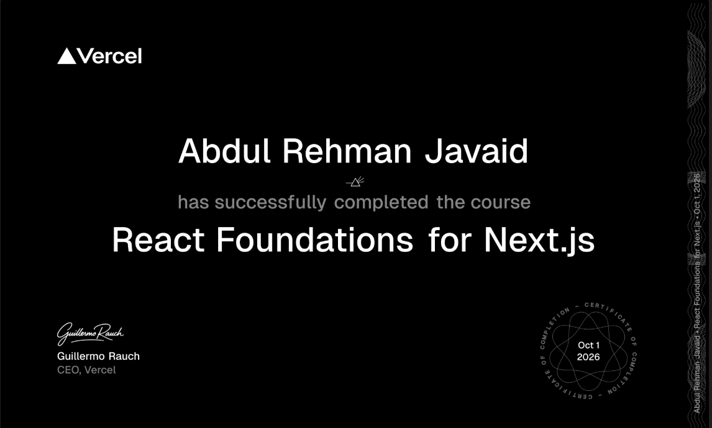

# ⚛️ React Course Project

A simple React and Next.js project created while learning the basics of React.

## 📚 Course

This project is based on the [React Foundations | Next.js](https://nextjs.org/learn/react-foundations) course.

## 🚀 Getting Started

### Install dependencies

```bash
npm install
```

### Start the development server

```bash
npm run dev
```

Open [http://localhost:3000](http://localhost:3000) in your browser.

## 🛠️ Built With

- React
- Next.js
- JavaScript

## 🏆 Course Certificate



[View the certificate](https://nextjs.org/learn/certificate?course=react-foundations&user=173873&certId=react-foundations-173873-1790872940436)